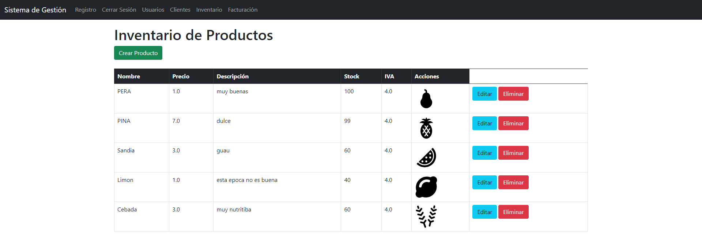

# Nombre del Proyecto ERP

Breve descripción del proyecto: Este es un pequeño proyecto ERP desarrollado utilizando Spring Boot, diseñado para gestionar eficientemente varios procesos empresariales internos. La base de datos se maneja a través de MySQL, facilitado por XAMPP, lo que hace que el despliegue y la configuración sean sencillos y rápidos.

## Características

- **Gestión de Recursos Empresariales**: De una manera sencilla podras crear: clientes,productos,facturas,usuarios y albaranes teniendo una gestion simple de los mismos.
- **Desarrollado en Spring Boot**: Aprovechando la facilidad y flexibilidad que ofrece Spring Boot.
- **Base de Datos MySQL**: Utilizando XAMPP para un manejo sencillo de la base de datos.



## Comenzando

Para poner en marcha este proyecto en tu máquina local, sigue estos pasos.

### Prerrequisitos

- Git
- XAMPP
- JDK (versión recomendada:18)

### Instalación

1. **Clonar el repositorio**

```bash
git clone URL_DEL_REPOSITORIO_GIT 
``` 
 

 ### licencia
All content in this repository is licensed under a Creative Commons Attribution-NonCommercial 4.0 International Public License

 ### contacto
 [me puedes encontrar aqui ](https://www.linkedin.com/in/pablo-andreu-669a9b273/)